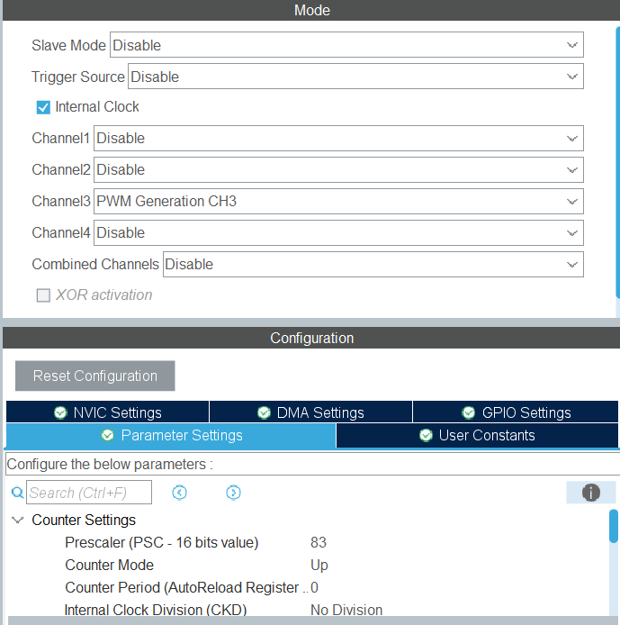
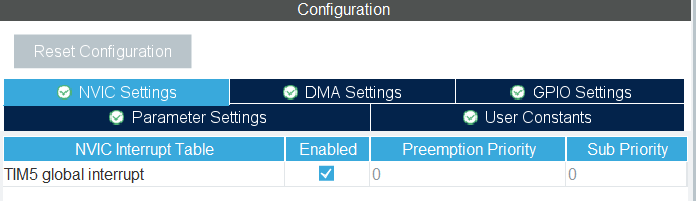

# 简介
    (2025/4/21)
本库对目前仅针对TB6600驱动下的42步进电机的基础功能进行了一定的封装, 和直流电机的驱动步骤相似在调用**stepmotor_attach()**函数和**stepmotor_init()**函数之后仅通过结构体数组**stepm**然后指定枚举变量中的id即可完成对步进电机的基础操作, 其中最核心的是控制函数**step_move**的实现, 该函数可以在开环状态下指定步进电机的**步数**和**频率(速度)**进行控制, 后续可能会更新一些经典的控制模型.\
先贴一下项目代码
[项目源码](https://github.com/1jianai1/Electronic_Hardware_Lib)
# cubemx 配置
如果要使用此库, 你只需要在cubemx中完成以下配置:
1. 打开定时器的PWM通道并将 Prescaler设置为83(我的时钟主频为84分频后为1MHz, 这个并不是一定得是1MHz, 后面会说)

2. 打开NVIC

3. 配置相关的GPIO, 如方向引脚, 这个很简单我就不贴图了

# 移植
如果你的硬件平台和我一样, 无脑粘贴就行, 如果不一样, 则需要修改相关代码
1. 修改类型(如果不是stm32HAL库)
主要是硬件层结构体的类型声明, 和**stepmotor_attach**函数, 需要修改类型
```c
typedef struct {
    // todo 硬件参数层
    TIM_HandleTypeDef* htim;    //定时器句柄
    uint32_t Channel;           // 输出通道
    GPIO_TypeDef* enType;       //使能引脚类别
    uint16_t  enPin;            //使能引脚pin
    GPIO_TypeDef* dirType;      //方向引脚类别
    uint16_t  dirPin;           //方向引脚pin
}STEPMOTOR_HARDWARE;
```
```c
void stepmotor_attach(
        STEPID id,
        TIM_HandleTypeDef* htim,
        uint32_t Channel,           // 输出通道
        GPIO_TypeDef* enType,        //使能引脚类别
        uint16_t  enPin,             //使能引脚pin
        GPIO_TypeDef* dirType,      //方向引脚类别
        uint16_t  dirPin           //方向引脚pin
        );
```

2. 底层接口函数封装
这里都添加在了**step_motor.c**中的部分以static声明的函数当中, 根据注释功能修改函数的实现:
```c
static void en_set(STEPID id){// todo 使能置高
    STEPMOTOR_HARDWARE* hw = &stepmotorhws[id];
    hw->enType->BSRR = hw->enPin;
}
static void en_reset(STEPID id){// todo 使能置低
    STEPMOTOR_HARDWARE* hw = &stepmotorhws[id];
    hw->enType->BSRR = (uint32_t)hw->enPin << 16U;                 // 置位
}

static void dir_set(STEPID id){// todo 方向置高
    STEPMOTOR_HARDWARE* hw = &stepmotorhws[id];
    hw->dirType->BSRR = hw->dirPin;
}
static void dir_reset(STEPID id){// todo 方向置低
    STEPMOTOR_HARDWARE* hw = &stepmotorhws[id];
    hw->dirType->BSRR = (uint32_t)hw->dirPin << 16U;                 // 置位
}

static void tim_start(STEPID id){// todo 定时器启动
    STEPMOTOR_HARDWARE* hw = &stepmotorhws[id];
    hw->htim->Instance->CR1 |= TIM_CR1_CEN;
}
static void tim_stop(STEPID id){// todo 定时器停止并清0
    STEPMOTOR_HARDWARE* hw = &stepmotorhws[id];
    __HAL_TIM_SET_COUNTER(hw->htim, 0);
    __HAL_TIM_CLEAR_FLAG(hw->htim, TIM_FLAG_UPDATE);
}

static void pwm_start(STEPID id){// todo pwm启动
    STEPMOTOR_HARDWARE* hw = &stepmotorhws[id];
    HAL_TIM_PWM_Start(hw->htim, hw->Channel);
}
static void pwm_stop(STEPID id){// todo pwm停止 其实将比较值赋为0就行
    STEPMOTOR_HARDWARE* hw = &stepmotorhws[id];
    HAL_TIM_PWM_Stop(hw->htim, hw->Channel);
}

static void pwm_startIT(STEPID id){// todo pwm中断开启
    STEPMOTOR_HARDWARE* hw = &stepmotorhws[id];
    HAL_TIM_PWM_Start_IT(hw->htim, hw->Channel);
}
static void pwm_stopIT(STEPID id){// todo pwm中断停止
    STEPMOTOR_HARDWARE* hw = &stepmotorhws[id];
    HAL_TIM_PWM_Stop_IT(hw->htim, hw->Channel);
}
static void pwm_setcompare(STEPID id, int32_t freq){// todo 设置50%的占空比
    // todo 重新设置占空比(占空比永远为比较值的一半, 即50%占空比)
    STEPMOTOR_HARDWARE* hw = &stepmotorhws[id];
    if(freq > 0){
        hw->htim->Instance->ARR = Hclk/freq - 1;
        __HAL_TIM_SET_COMPARE(hw->htim, hw->Channel, hw->htim->Instance->ARR/2); // 占空比无所谓 一半即可
    }
}
```


# 初始化
## 成员变量概览
先看看一个对象所包含的属性, 这里我都敲了注释, 主要是使用**STEPMOTOR**作为对象的类型.
```c
typedef struct {
    // todo 硬件参数层
    TIM_HandleTypeDef* htim;    //定时器句柄
    uint32_t Channel;           // 输出通道
    GPIO_TypeDef* enType;       //使能引脚类别
    uint16_t  enPin;            //使能引脚pin
    GPIO_TypeDef* dirType;      //方向引脚类别
    uint16_t  dirPin;           //方向引脚pin

    // todo 硬件API重写层
    STEPMOTOR_INTERFACE enSet;                // 方向引脚置位
    STEPMOTOR_INTERFACE enReset;                // 方向引脚置位
    STEPMOTOR_INTERFACE dirSet;                // 方向引脚置位
    STEPMOTOR_INTERFACE dirReset;                // 方向引脚置位
    STEPMOTOR_INTERFACE htimStop;              // 停止并复位定时器
    STEPMOTOR_INTERFACE htimStart;              // 重新启动定时器

    STEPMOTOR_INTERFACE pwmStop;                // pwm停止
    STEPMOTOR_INTERFACE pwmStart;               // pwm启动
    STEPMOTOR_INTERFACE pwmStopIT;             // pwm中断计数停止
    STEPMOTOR_INTERFACE pwmStartIT;            // pwm中断计数启动
    STEPMOTOR_SPEED_INTERFACE pwmSetCompare;          // pwm设置为50%的占空比

}STEPMOTOR_HARDWARE;

typedef struct{

    STEPMOTOR_HARDWARE* hw;  // 硬件接口封装层

    // todo 参数层
    uint32_t cur_freq;  // 当前频率Hz
    uint16_t cur_step;  // 当前步数
    uint8_t dir;        // 当前方向

    // todo 目标值
    uint16_t tar_step;  // 目标步数

    // todo 限制层
    uint8_t is_limit_step;          // 你是否要限制步数
    uint8_t is_finish;              // 是否完成路程
    int16_t accumulate_step;       // 累计步数
    int32_t max_step;              // 最大步数  - 配合累计步数以限幅
    int32_t min_step;              // 最小步数  - 配合累计步数以限幅
    uint32_t min_freq;             // 最小运行频率
    uint32_t max_freq;             // 最大运行频率

    // todo 函数接口层
    STEPMOTOR_INTERFACE limitStep;
    STEPMOTOR_INTERFACE noLimitStep;
    STEPMOTOR_STEP_INTERFACE stepMove;      // 指定步数和速度进行移动
    STEPMOTOR_INTERFACE stop;               // 立即停止
    STEPMOTOR_RANGE_INTERFACE setRange;     // 设置相关范围的接口

}STEPMOTOR;

```

我们需要将**step_motor.c**和**step_motor.h**添加到你的工程目录下面, 然后调用初始化函数
```c
void stepmotor_attach(
        STEPID id,                  // 电机id
        TIM_HandleTypeDef* htim,    // 电机对应定时器
        uint32_t Channel,           // 输出通道
        GPIO_TypeDef* enType,        //使能引脚类别
        uint16_t  enPin,             //使能引脚pin
        GPIO_TypeDef* dirType,      //方向引脚类别
        uint16_t  dirPin           //方向引脚pin
        );
```
```c
stepmotor_init();
```
前者**stepmotor_attach**是引脚定向, 为了后面我们可以用结构体数组引出各种属性和函数进行调用, 以下是函数的实现流程
```c
void stepmotor_attach(
        STEPID id,
        TIM_HandleTypeDef* htim,
        uint32_t Channel,           // 输出通道
        GPIO_TypeDef* enType,        //使能引脚类别
        uint16_t  enPin,             //使能引脚pin
        GPIO_TypeDef* dirType,      //方向引脚类别
        uint16_t  dirPin           //方向引脚pin
        ){
    STEPMOTOR_HARDWARE* hw = &stepmotorhws[id];
    // todo 硬件引脚重指定
    hw->htim = htim;            // 硬件接口初始化
    hw->Channel = Channel;
    hw->enType = enType;
    hw->enPin = enPin;
    hw->dirType = dirType;
    hw->dirPin = dirPin;

    // todo 硬件函数接口
    hw->enSet = en_set;
    hw->enReset = en_reset;
    hw->dirSet = dir_set;
    hw->dirReset = dir_reset;
    hw->htimStart = tim_start;
    hw->htimStop = tim_stop;
    hw->pwmStop = pwm_stop;
    hw->pwmStart = pwm_start;
    hw->pwmStartIT = pwm_startIT;
    hw->pwmStopIT = pwm_stopIT;
    hw->pwmSetCompare = pwm_setcompare;

    // todo 控制接口函数
    stepm[id].hw = hw;
    stepm[id].limitStep = limit_step;
    stepm[id].noLimitStep = no_limit_step;
    stepm[id].stepMove = step_move;    // 移动函数接口赋值
    stepm[id].stop = step_stop;        // 立即停止接口指定
    stepm[id].setRange = set_range;    // 范围设置指向
}
```

**stepmotor_init()** 是初始化函数, 在这里cubemx已经初始化完成, 我只添加了相关外设如定时器中断等启动函数也可以添加自己的初始化代码.
```c
void stepmotor_init(void){
    for(uint8_t i = 0; i < STEP_SUM; i++){
        STEPMOTOR* m = &stepm[i];                      // 获取对象指针
        // todo 其他初始化

        // todo 启动
        m->hw->pwmStartIT(i);   // PWM中断
        m->hw->enSet(i);        // 使能引脚使能
    }
}
```

# 使用库进行控制
## 步数&速度控制
目前没有添加太多的算法, 仅仅是开环的指定**速度**和**位移**移动的函数, 不过这应该也是后续底层最为核心的函数:
```c
    // 指定id             id      指定走多少步  指定速度/频率
stepm[STEPID].stepMove(STEPID, int32_t,     uint32_t);
```
仅仅是使用的话, 只需要传入对应电机对象id和相关参数即可, 其中第二个参数是用于指定目标是多少步, 支持正负号, 可以输入负值, 它意味着电机**朝反方向转**.
同时, 因为我们在初始化配置的时候**开启了PWM中断**所以在这里我们也需要在中断中添加部分代码:
```c
void HAL_TIM_PWM_PulseFinishedCallback(TIM_HandleTypeDef *htim)
{
    if(htim == stepm[SM1].hw->htim)    // 回调函数检测为某个步进电机对应的定时器
    {
        Stepper_UpdateHandler(SM1);
    }
}
```
在中断回调函数**HAL_TIM_PWM_PulseFinishedCallback**中, 我们只需要重复执行**Stepper_UpdateHandler**函数就行, 关于这个函数的实现其实很简单, 下面我会说明.

而**stepMove**函数的具体实现如下:
```c
// todo 以指定速度(频率), 移动指定步数
static void step_move(STEPID id, int32_t tar_steps, uint32_t freq){
    STEPMOTOR* m = &stepm[id];

    if(tar_steps == 0 || freq <=0){m->is_finish = 1;return;}
    m->is_finish = 0;   // 刷新完成标志位

    // todo 停止并复位定时器
    m->hw->pwmStopIT(id);
    m->hw->htimStop(id);

    //todo 方向引脚置位
    m->dir = (tar_steps >= 0) ? 1 : 0;
    if(m->dir) m->hw->dirSet(id);
    else m->hw->dirReset(id);

    // todo 设置目标步数 并对其进行步数限幅
    if(m->is_limit_step){
        int32_t pre_accumulate_step = m->accumulate_step;  // 存储上一次的步数
        m->accumulate_step = (int16_t) LIMIT(m->accumulate_step + tar_steps, m->max_step, m->min_step);
        m->tar_step = abs( m->accumulate_step - pre_accumulate_step);
    }else{
        m->tar_step = tar_steps;
    }

    m->cur_step = 0;    // 每刷新一次当前步数置为0

    // todo 限制频率范围  注意符号和取值范围
    freq = LIMIT((int32_t)freq, (int32_t)m->max_freq, (int32_t)m->min_freq);
    m->cur_freq = freq; // 获取当前频率

    // todo 重新设置占空比(占空比永远为比较值的一半, 即50%占空比)
    m->hw->pwmSetCompare(id, freq);

    // todo 重新启动定时器
    m->hw->htimStart(id);

    // todo 启用更新中断
    m->hw->pwmStartIT(id);
}
```
以及中断函数
```c
// todo (重要)定时器更新中断处理（需在stm32f4xx_it.c(或者中断回调函数)中调用）
void Stepper_UpdateHandler(STEPID id) {
    STEPMOTOR* m = &stepm[id];
    if(m->cur_step < m->tar_step) {
        m->cur_step++;
    } else {                            // todo 如果检测到当前步数到了目标值就直接PWM_Stop不发波了
        m->is_finish = 1;
        m->hw->pwmStopIT(id);
    }
}
```
每一步的操作我都敲了注释, 总体上的控制思路如下(这也是比较常用的控制思路):\
通过PWM中断去对每一步进行计数存入成员变量**cur_step**中, 方波每个周期进一次中断, 同时步进电机收到一个脉冲, 电机走一步. 当电机的**当前步数大于等于目标步数pwm停止**.

## 电机停止
```c
stepm[STEPID].stop(STEPID);
```
调用即可, 函数实现仅仅是让**目标步数等于当前步数**
```c
// todo 立即停止电机
static void step_stop(STEPID id) {
    STEPMOTOR * m = &stepm[id];
    //__HAL_TIM_DISABLE_IT(m->hw->htim, TIM_IT_UPDATE);
    m->tar_step = m->cur_step;
}
```

## 设置范围
```c
//                      id     模式    最大值      最小值
stepm[STEPID].setRange(STEPID, char , int32_t , int32_t );
```
这里提供了两种模式:
- 'f': 设置速度/频率范围 -- 较为常见
- 's': 设置最大累计步数范围 -- 我控制二维步进云台时用的, 防止云台跑到范围外, 对累计的步数进行限幅
```c
// todo 立即停止电机
static void set_range(STEPID id, char mode, int32_t ma, int32_t mi){
    STEPMOTOR* m = &stepm[id];
    switch (mode) {
        case 'f':   // todo 设置频率范围
            m->max_freq = ma;
            m->min_freq = mi;
            break;
        case 's':
            m->max_step = ma;
            m->min_step = mi;
            break;
    }
}
```

## 是否启用位移限幅
主要是对标志位**is_limit_step**进行操作, 如果你不需要累计位移控制, 比如说小车的应用场景, 可以置位不再限幅
```c
//todo 调用示例
stepm[STEPID].limitStep(STEPID);
stepm[STEPID].noLimitStep(STEPID);

//todo 实现
static void limit_step(STEPID id){stepm[id].is_limit_step = 1;}
static void no_limit_step(STEPID id){stepm[id].is_finish = 0;}
```


